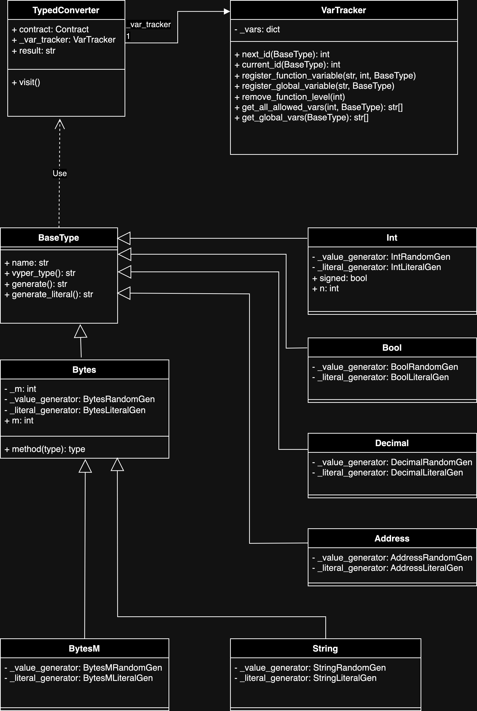

## TypedConverter
### General architecture


### Protobuf structure
The main structure is the `Contract` message
```protobuf
message Contract {
  repeated VarDecl decls = 1;
  repeated Func functions = 2;
}
```
It consists of sets `VarDecl` and `Func` messages representing a declaration of variables and functions respectively.  
The most significant changes concern the `VarDecl` structure. Now, instead of the general `Expression` message it contains a `TypedExpression`:
```protobuf
message VarDecl {
  oneof type {
    Bool b = 2;
    Decimal d = 3;
    BytesM bM = 4;
    String s = 5;
    Address adr = 6;
    ByteArray barr = 7;
  }
  Int i = 1;
  TypedExpression expr = 8;
}

message TypedExpression {
  AddressExpression addrExp = 1;
  BoolExpression boolExp = 2;
  BytesMExpression bmExp = 3;
  BytesExpression bExp = 4;
  StringExpression strExp = 5;
  DecimalExpression decExpression = 6;
}
```
`TypedExpression` contains all possible expressions separated by its return type. Which one to use is decided by the content of the `VarDecl`(e.g. if a `VarDecl` message contains field `b` representing boolean value, `BoolExpression boolExp` of the `TypedExpression` will be used).  
Such an approach decreases inconsistency between a variable type and a type of the assigned expression.  
Expressions named as `<type>Expression`(e.g. `AddressExpression`, `BoolExpression`, etc...) combine expressions return type `<type>`. For example:
```protobuf
message AddressExpression {
  oneof expr {
    CreateMinimalProxy cmp = 1;
    CreateFromBlueprint cfb = 2;
    VarRef varRef = 4;
  }
  Literal lit = 3;
}
```
all the expressions within `AddressExpression` return `address` value, so we can assign the whole expressions wherever an `address` value is required.

### Message converters
(Almost) Each message type is handled by a respective handler returns a string representation of the converted message.  
The handlers must not change the converted value(e.g. adding prefix shifts, etc...). If such adjustments are required, it should be managed by a caller of the handler.

### Implemented statements
* Build-in calls
* For-loop statements
* If-statements
* Typed expressions  
_The result of a typed expression can be assigned to a variable and passed to a statement accepting a value or an expression of the respective type  
Also, an expression can be combined from other expressions_
  * Build-ins
  * Var references
  * Binary operation
  * Unary operation
